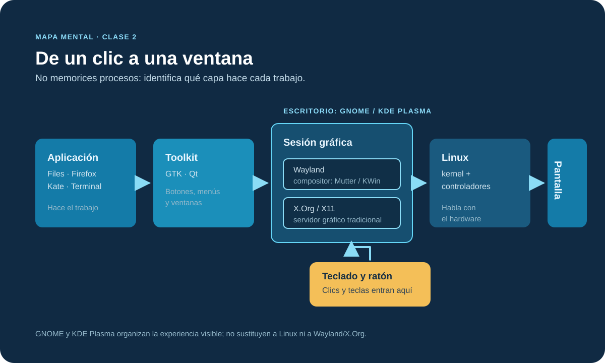

# 4. X Window y Wayland

**X.Org y Wayland no son escritorios ni aplicaciones.** Son la capa que permite que una aplicación gráfica reciba teclado y ratón, dibuje una ventana y la muestre en la pantalla. GNOME y KDE Plasma son los escritorios que organizan esa experiencia sobre Linux.

## Índice

- [4.1 De un clic a una ventana](#41-de-un-clic-a-una-ventana)
- [Objetivo de esta parte](#objetivo-de-esta-parte)
- [Antes de la demostración](#antes-de-la-demostración)
- [El mapa que necesitas](#el-mapa-que-necesitas)
- [X.Org y Wayland en una frase](#xorg-y-wayland-en-una-frase)
- [Identifica tu sesión (sólo consulta)](#identifica-tu-sesión-sólo-consulta)
- [Escritorio o SSH](#escritorio-o-ssh)
- [Demostración guiada: 4 minutos](#demostración-guiada-4-minutos)
- [Errores frecuentes](#errores-frecuentes)

## 4.1 De un clic a una ventana

### Objetivo de esta parte

Al terminar, debes poder explicar sin memorizar procesos ni siglas:

- qué parte de Linux muestra una ventana y recibe un clic;
- que GNOME y KDE Plasma son escritorios, mientras que X.Org y Wayland son la base gráfica que usan;
- por qué una EC2 puede funcionar perfectamente sin escritorio ni pantalla.

### Antes de la demostración

Este recorrido ocurre en una VM con escritorio abierto, no en una terminal SSH de EC2. La VM sirve para **observar una sesión gráfica**; la EC2 sigue siendo el lugar para practicar administración por terminal. No instales GNOME, KDE ni un servidor gráfico en una EC2 para seguir esta parte.

Abre la terminal desde la raíz del curso: la carpeta que contiene `README.md` y `data/`. La ruta varía según dónde clonaste el repositorio; no copies una ruta ajena. Si no estás ahí, usa la navegación de la Clase 1 para llegar a tu copia del curso y confirma:

```bash
pwd
ls README.md data
```

> **Cuidado.** Esta sección no requiere crear archivos ni cambiar la sesión, la red o la resolución. Si no tienes VM gráfica, sigue el diagrama y la demostración del instructor.

### El mapa que necesitas

> **Situación real.** Abres Files, haces clic en una carpeta y aparece una ventana. Para trabajar bien no necesitas conocer todos los procesos que intervienen; sólo necesitas saber qué capa hace cada trabajo y no confundirlas.



*Lee el mapa de izquierda a derecha para ver cómo llega una ventana a la pantalla. El teclado y el ratón recorren el camino inverso: entran por la sesión gráfica y llegan a la aplicación activa.*

| Capa | Ejemplo que puedes reconocer | Trabajo que hace |
|---|---|---|
| **Aplicación** | Files, Firefox, Kate, Terminal | Hace el trabajo que pediste y muestra su ventana. |
| **Toolkit** | GTK o Qt | Construye botones, menús, cuadros de diálogo y ventanas. |
| **Sesión gráfica** | Wayland o X.Org | Coordina el dibujo de ventanas y entrega clics y teclas. |
| **Escritorio** | GNOME o KDE Plasma | Organiza paneles, lanzadores, espacios de trabajo y notificaciones. |
| **Linux y controladores** | kernel y GPU | Hablan con el hardware: pantalla, teclado, ratón y tarjeta gráfica. |

Qué debes retener: **Files no es GNOME, GNOME no es Wayland y Wayland no es Linux**. Son capas que colaboran.

> **Comprueba.** Señala en la VM una aplicación abierta y responde: “¿es Files, GNOME/KDE o Wayland/X.Org?”. La respuesta correcta es **una aplicación**.

### X.Org y Wayland en una frase

- **X.Org** es la base gráfica tradicional de Linux. Una aplicación se comunica con el servidor X para mostrar ventanas y recibir entrada.
- **Wayland** es el enfoque moderno. El compositor de la sesión —por ejemplo Mutter en GNOME o KWin en KDE— coordina las ventanas, la pantalla y la entrada.

No es necesario elegir, instalar ni configurar uno durante la clase. Ubuntu actual suele iniciar con Wayland; algunas sesiones, equipos o programas pueden usar X.Org/X11. **GNOME y KDE Plasma pueden funcionar sobre cualquiera de los dos.**

| Si oyes… | Traducción útil |
|---|---|
| “Estoy en Wayland” | La sesión gráfica usa el protocolo moderno para conectar aplicaciones, entrada y pantalla. |
| “Esta sesión es X11” | La sesión usa la arquitectura gráfica tradicional de X.Org. |
| “Uso GNOME” o “uso KDE” | Describe el escritorio visible, no el protocolo gráfico ni el kernel. |

> **Cuidado.** No conviertas esto en una discusión de marcas. Para soporte inicial, importa saber qué sesión está abierta y si el problema pertenece a una aplicación, al escritorio o a la pantalla.

### Identifica tu sesión (sólo consulta)

Abre GNOME Terminal o Konsole **dentro de la VM gráfica** y ejecuta:

```bash
echo "$XDG_SESSION_TYPE"
echo "$XDG_CURRENT_DESKTOP"
```

La primera consulta responde por la base gráfica; la segunda nombra el escritorio. Las variables ya existen en la sesión: escribe el comando completo, incluido `$` dentro de las comillas.

Salida representativa:

```text
wayland
ubuntu:GNOME
```

- La primera línea puede ser `wayland` o `x11`.
- La segunda puede ser `ubuntu:GNOME`, `GNOME`, `KDE` u otro nombre de escritorio.
- Una salida vacía suele significar que estás en SSH, una consola virtual o una sesión sin escritorio. No indica que Linux esté dañado.

### Escritorio o SSH

La pregunta práctica no es “¿cuál es mejor?”, sino **qué necesitas hacer y dónde ocurre**.

| Situación | Herramienta principal | Por qué |
|---|---|---|
| Ver una aplicación local, ajustar una pantalla o ayudar a una persona frente a su equipo | Escritorio gráfico | Necesitas ventanas, ratón, pantalla o una aplicación visual. |
| Revisar logs, desplegar un backend o administrar una EC2 | SSH y terminal | El servidor no necesita mostrar ventanas para ejecutar servicios. |
| Automatizar una tarea repetible | Script y terminal | El resultado puede repetirse, revisar y ejecutar sin una pantalla. |

Una terminal puede vivir dentro de GNOME o KDE Plasma, pero también existe sin escritorio. Por eso un servidor remoto puede ser Linux aunque nunca veas un panel, un menú ni un cursor.

### Demostración guiada: 4 minutos

1. En la VM, abre **Actividades** (GNOME) o **Kickoff** (KDE) y lanza Files o Dolphin. Eso muestra el **escritorio** iniciando una **aplicación**.
2. Haz clic en una carpeta y mueve la ventana. No cambies configuraciones: sólo observa que la sesión gráfica recibe tu entrada y dibuja la ventana.
3. Abre una terminal dentro de esa misma VM y ejecuta las dos consultas de la sección 4.3.
4. Vuelve a la EC2 por SSH y di qué falta allí: no Linux ni Bash, sino **una sesión gráfica con pantalla**.

> **Comprueba.** Completa esta frase: “En mi VM, ____ es el escritorio y ____ es el tipo de sesión. En la EC2 uso SSH porque el servicio no necesita ____”.

### Errores frecuentes

- Llamar “Linux” únicamente a lo que se ve en pantalla. Linux también existe en una EC2 sin escritorio.
- Creer que GNOME o KDE Plasma sustituyen al kernel. Son la experiencia visual que se ejecuta sobre Linux.
- Confundir Files/Dolphin con el escritorio completo. Son aplicaciones de archivos.
- Intentar abrir una aplicación gráfica por SSH como si hubiera una pantalla local disponible.
- Instalar una GUI en un servidor sólo para evitar usar SSH.
