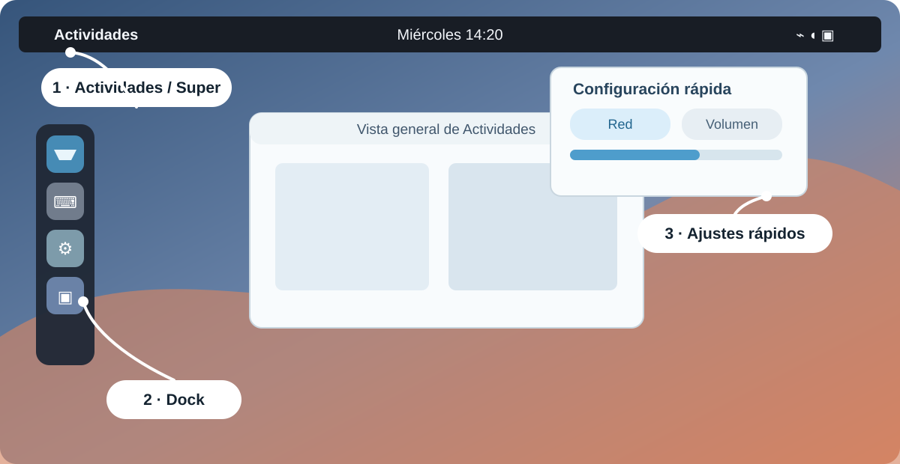
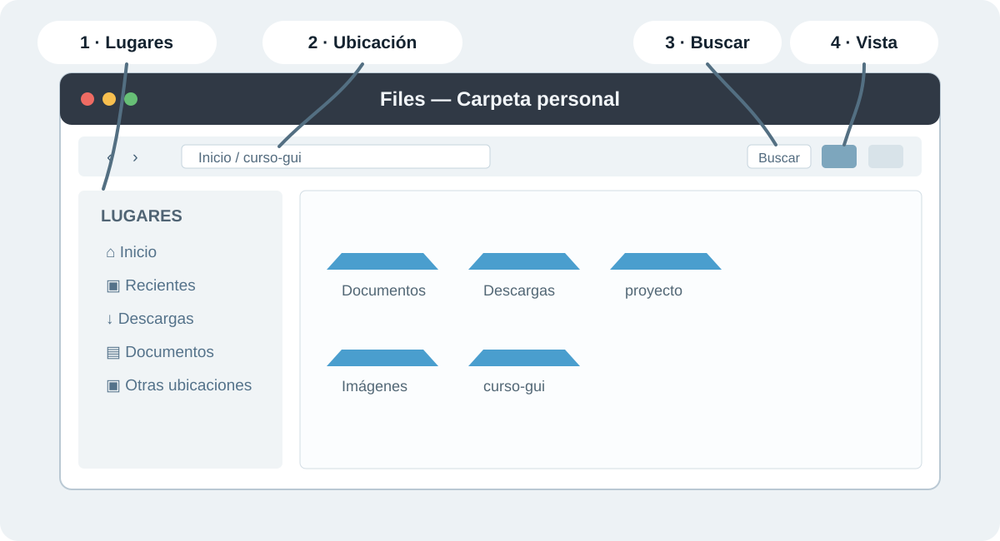

# 5. GNOME

**GNOME** es un entorno de escritorio: organiza ventanas, aplicaciones, notificaciones y espacios de trabajo sobre Linux. En Ubuntu Desktop, GNOME es la interfaz que verás; no reemplaza al kernel, al sistema de archivos ni a Bash.

> **Entorno de demostración.** La VM del instructor usa Ubuntu 24.04 LTS con GNOME. Los iconos o nombres menores pueden variar según la versión, pero la ruta de trabajo es la misma.

## Índice

- [Instalar Ubuntu GNOME en una VM (opcional)](#instalar-ubuntu-gnome-en-una-vm-opcional)
- [5.1 Mapa de GNOME](#51-mapa-de-gnome)
- [5.2 Files](#52-files)
- [5.3 Herramientas esenciales](#53-herramientas-esenciales)
- [5.4 Aplicaciones populares (opcional)](#54-aplicaciones-populares-opcional)
- [5.5 Espacios de trabajo (opcional)](#55-espacios-de-trabajo-opcional)
- [GNOME y KDE: diferencia de enfoque](#gnome-y-kde-diferencia-de-enfoque)
- [Glosario rápido de GNOME](#glosario-rápido-de-gnome)

### Instalar Ubuntu GNOME en una VM (opcional)

Para reproducir el recorrido en casa, usa [Ubuntu 24.04.4 Desktop para 64 bits (`amd64`)](https://releases.ubuntu.com/noble/ubuntu-24.04.4-desktop-amd64.iso). Es una imagen reciente de Ubuntu con GNOME; una revisión menor diferente de 24.04 puede cambiar iconos o textos, no la idea de la demostración.

1. Instala [VirtualBox](https://www.virtualbox.org/wiki/Downloads) para Windows, macOS o Linux.
2. Descarga la ISO oficial de Ubuntu indicada arriba (aproximadamente 6.2 GB).
3. En VirtualBox elige **Nueva** y crea `Ubuntu-GNOME`: tipo **Linux**, versión **Ubuntu (64-bit)**, al menos **4 GB de RAM**, **2 CPU** y un disco virtual **VDI** dinámico de **30 GB**.
4. En **Configuración → Almacenamiento**, selecciona la unidad óptica vacía, carga la ISO e inicia la VM. Elige **Install Ubuntu**.
5. Instala únicamente en el disco virtual creado por VirtualBox (por ejemplo, `VBOX HARDDISK`), reinicia y retira la ISO cuando la VM lo solicite.

> **Cuidado.** Esta práctica es opcional. No selecciones un disco físico ni reemplaces el sistema operativo de tu equipo para completar la Clase 2.

## Antes de la demostración

El instructor muestra GNOME desde Ubuntu Desktop o una VM preparada. Observa primero: no necesitas instalar otro escritorio, cambiar la red ni modificar configuraciones globales.

## Ruta corta para mostrar en clase

1. **Actividades:** abrir la vista general con el botón **Actividades** o la tecla `Super`.
2. **Files:** reconocer Lugares, búsqueda, ubicación y vistas.
3. **Herramientas esenciales:** Screenshot, Text Editor y System Monitor.
4. **Espacios de trabajo:** sólo si queda tiempo.
5. **Comparación con KDE:** distinguir enfoque de interfaz, no “dos Linux distintos”.

## 5.1 Mapa de GNOME

GNOME concentra el trabajo en **Actividades**. Desde ahí se buscan aplicaciones, se ven las ventanas abiertas y se cambia de espacio de trabajo. Es distinto del menú por categorías de KDE Plasma, pero ambos permiten llegar a las mismas aplicaciones Linux.

*Mapa visual: usa **Actividades** o `Super` para abrir la vista general. La configuración rápida sólo se observa durante la demostración.*

| Elemento | Dónde se reconoce | Para qué sirve |
|---|---|---|
| **Actividades** | Esquina superior izquierda o tecla `Super` | Abrir la vista general, buscar aplicaciones y ver espacios de trabajo. |
| **Dock** | Barra lateral o inferior, según la distribución | Acceso rápido a aplicaciones frecuentes y ventanas abiertas. |
| **Configuración rápida** | Menú de iconos de red, volumen y energía | Consultar estado y controles inmediatos de la sesión. |

> **Cuidado.** No cambies red, brillo, energía o sesión en una máquina compartida sólo para explorar el menú.

## 5.2 Files

**Files** (también llamado Nautilus) es el gestor de archivos de GNOME. Esta demostración no repite crear, copiar, mover o cambiar permisos: esas operaciones ya se aprendieron en Clase 1. Aquí importa reconocer cómo GNOME presenta las rutas y cómo se encuentra información visualmente.

*Mapa visual de Files: identifica primero **Lugares**, la **ubicación**, **Buscar** y los botones de **vista**.*

- **Lugares:** permite ir a Inicio, Recientes, Descargas, Documentos y otras ubicaciones.
- **Ubicación:** muestra dónde estás; con `Ctrl+L` puedes escribir o copiar una ruta cuando necesites documentarla.
- **Buscar:** usa el botón de búsqueda o `Ctrl+F` para encontrar elementos dentro de la ubicación abierta.
- **Vista:** alterna entre iconos y lista para priorizar vista previa o detalles.

> **Cuidado.** Files no tiene una vista dividida equivalente a Dolphin. Si necesitas comparar origen y destino durante una demostración, usa dos ventanas o elige Dolphin; no presentes una limitación como si fuera un error del alumno.

## 5.3 Herramientas esenciales

| Herramienta | Qué mostrar | Cuándo ayuda |
|---|---|---|
| 📸 **Screenshot** | Seleccionar una región o ventana | Documentar un ticket o una evidencia visual. |
| 📝 **Text Editor** | Abrir un archivo de texto y sus números de línea | Leer notas o configuración de práctica. |
| 📊 **System Monitor** | Procesos y uso de CPU o memoria | Orientar una consulta local antes de investigar con más detalle. |
| 🔎 **Búsqueda de Actividades** | Escribir el nombre de una aplicación | Abrir una herramienta sin recorrer menús. |
| 🧮 **Calculator (opcional)** | Cambiar a modo Programador | Convertir un valor entre decimal, hexadecimal y binario durante una demostración técnica. |

Estas herramientas sirven para observar y documentar. Los comandos de búsqueda, procesos, archivos y permisos se conservan en sus capítulos de terminal.

## 5.4 Aplicaciones populares (opcional)

Estas aplicaciones no son parte de GNOME, pero se usan con frecuencia sobre Ubuntu Desktop. Se muestran sólo si ya están instaladas en la VM del instructor; no se instalan durante la clase.

| Aplicación | Qué mostrar en un minuto | Uso habitual |
|---|---|---|
| 📹 **OBS Studio** | Escena, fuentes y botón de grabación | Grabar una demostración de pantalla o una incidencia reproducible. |
| 🎙️ **Audacity** | Pista de audio y medidor de entrada | Grabar o limpiar audio para material de capacitación. |
| 🎨 **GIMP** | Capas y herramienta de anotación | Preparar una captura con marcas antes de documentar un ticket. |
| 📊 **GNU Octave** | Consola y una gráfica de ejemplo preparada | Cálculo numérico y prototipos académicos o de ingeniería. |
| 🖥️ **Remmina** | Tipo de conexión RDP/VNC/SSH | Acceder a una estación remota autorizada desde soporte. |

> **Cuidado.** No inicies grabaciones, conexiones remotas ni cambios de audio en equipos ajenos. El objetivo es reconocer la herramienta y cuándo sería apropiada.

## 5.5 Espacios de trabajo (opcional)

En **Actividades**, GNOME muestra espacios de trabajo para separar tareas: por ejemplo, documentación en uno y una terminal o navegador en otro. Arrastra una ventana a otro espacio o usa la vista general para cambiar entre ellos.

Es opcional porque depende del flujo de cada persona. La idea importante es que mover una ventana de espacio no la cierra ni cambia sus archivos.

## GNOME y KDE: diferencia de enfoque

| Aspecto | GNOME | KDE Plasma |
|---|---|---|
| Punto de partida | Actividades y búsqueda | Kickoff y panel |
| Organización | Vista general y espacios de trabajo | Paneles, widgets y lanzadores visibles |
| Archivos | Files, interfaz más simple | Dolphin, panel dividido y más vistas |
| Personalización | Menos opciones expuestas | Más opciones en la propia interfaz |

GNOME y KDE cambian la experiencia visual, no los conceptos Linux que ya aprendiste: rutas, usuarios, permisos y comandos siguen siendo los mismos.

## Glosario rápido de GNOME

| Término | Qué es |
|---|---|
| **GNOME Shell** | Componente que muestra el panel superior, Actividades, notificaciones y la vista general. |
| **Actividades** | Puerta de entrada para buscar aplicaciones, ver ventanas y cambiar de espacio de trabajo. |
| **Dock** | Barra de accesos a aplicaciones frecuentes y ventanas abiertas. |
| **Configuración rápida** | Menú de controles inmediatos de red, sonido, energía y sesión. |
| **Files / Nautilus** | Gestor de archivos de GNOME. |
| **Espacio de trabajo** | Área separada para organizar ventanas sin cerrar aplicaciones. |
