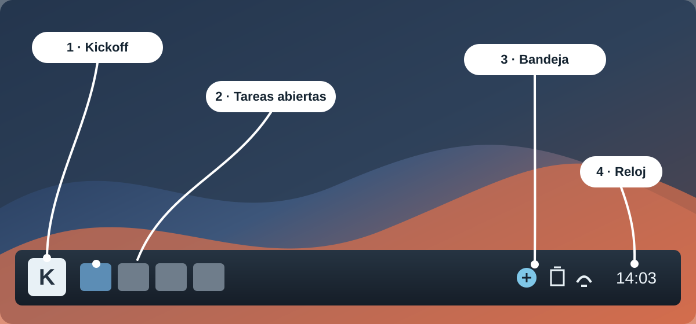
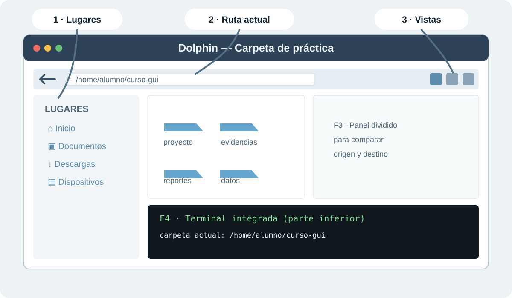
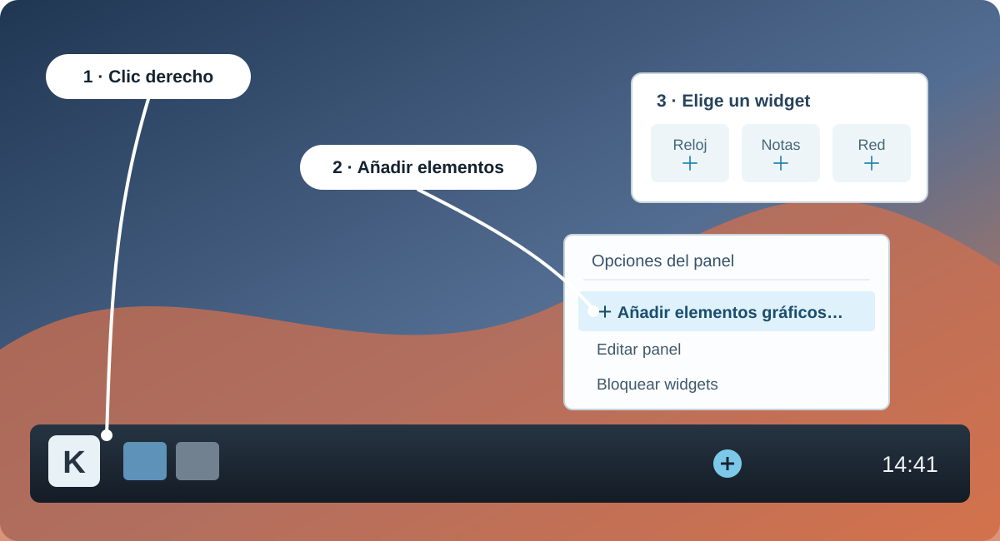

# 6. KDE Plasma

**KDE Plasma** es un entorno de escritorio: la capa visual que aporta panel, menú de aplicaciones, ventanas, widgets y herramientas gráficas para trabajar sobre Linux. No es otra distribución ni otro kernel; **Kubuntu** combina Ubuntu como sistema base con KDE Plasma como interfaz.

Recorrido práctico hands-on para conocer esta interfaz. Compararemos Plasma con GNOME y relacionaremos las acciones visuales con los conceptos Linux ya aprendidos, sin repetir comandos de terminal.

## Índice

- [Instalarla en una VM (práctica opcional)](#instalarla-en-una-vm-práctica-opcional)
- [6.1 Partes de la pantalla](#61-partes-de-la-pantalla)
- [6.2 Dolphin File Manager](#62-dolphin-file-manager)
- [6.3 Apps esenciales de KDE](#63-apps-esenciales-de-kde)
- [6.4 Herramientas de productividad](#64-herramientas-de-productividad)
- [6.5 KMenuEdit (opcional)](#65-kmenuedit-opcional)
- [6.6 Configuración avanzada del sistema](#66-configuración-avanzada-del-sistema)
- [6.7 Personalizar el panel](#67-personalizar-el-panel)
- [KDE vs GNOME: diferencias clave](#kde-vs-gnome-diferencias-clave)
- [Glosario rápido de KDE](#glosario-rápido-de-kde)

> **Imagen usada en la demostración.** La VM del instructor usa **`kubuntu-16.04.6-desktop-amd64.iso`** (Kubuntu 16.04.6 Desktop para 64 bits), con KDE Plasma. Los nombres exactos de algunos menús pueden variar con la versión; busca la función descrita, no una etiqueta idéntica.

### Instalarla en una VM (práctica opcional)

1. Instala [VirtualBox](https://www.virtualbox.org/wiki/Downloads) para tu sistema anfitrión (Windows, macOS o Linux).
2. Descarga [la ISO oficial de Kubuntu 16.04.6 para `amd64`](https://cdimage.ubuntu.com/kubuntu/releases/16.04/release/kubuntu-16.04.6-desktop-amd64.iso) —ocupa aproximadamente 1.6 GB—.
3. En VirtualBox elige **Nueva** y crea `Kubuntu-KDE`: tipo **Linux**, versión **Ubuntu (64-bit)**, al menos **2 GB de RAM**, **2 CPU** y un disco virtual **VDI** dinámico de **25 GB**.
4. En **Configuración → Almacenamiento**, selecciona la unidad óptica vacía y carga la ISO descargada. Inicia la VM y elige **Install Kubuntu**.
5. En la pantalla de destino, selecciona instalar sobre el **disco virtual** creado por VirtualBox (por ejemplo, `VBOX HARDDISK`). Finaliza el asistente, reinicia y retira la ISO cuando la VM lo pida.

> **Cuidado.** Kubuntu 16.04 es una versión histórica sin soporte de seguridad. Úsala sólo en una VM de práctica aislada. No selecciones un disco físico ni reemplaces el sistema operativo de tu equipo para completar la Clase 2.

## Objetivos

- Ubicar panel, Kickoff, bandeja y widgets.
- Explorar Dolphin: Lugares, vistas, `F3` y `F4`.
- Identificar herramientas básicas de KDE.
- Distinguir KDE Plasma de GNOME.

## Antes de la demostración

El instructor muestra una VM de KDE Plasma. Sólo observa: no necesitas instalar KDE ni modificar tu equipo.

> **Cuidado.** No cambies red, permisos, asociaciones de archivos, panel ni sesión. El instructor usa cambios reversibles en la VM.

## Ruta corta para mostrar en clase

1. **Panel y Kickoff:** ubicar la lógica general de Plasma.
2. **Dolphin:** mostrar lugares, vistas, panel dividido, ruta y terminal integrada como característica de interfaz.
3. **Herramientas esenciales:** Spectacle, Ark, Okular, Kate y KFind.
4. **Comparación final con GNOME:** identificar qué cambia en la experiencia, no en Linux.

Los apartados restantes quedan como exploración guiada: se muestran si hay tiempo o si responden a una necesidad del grupo.

## 6.1 Partes de la pantalla

> **Situación real.** Una persona de soporte debe orientarse rápidamente en una estación que usa Plasma. Antes de abrir herramientas, identifica qué parte lanza aplicaciones, qué parte muestra tareas y dónde aparecen red, volumen o notificaciones.

| Qué mostrar | Ruta o acción en Plasma | Qué debe observar el alumno |
|---|---|---|
| Panel | Barra normalmente inferior | Contiene lanzador, tareas abiertas, widgets y bandeja; es configurable. |
| Kickoff | Botón con la **K** al extremo izquierdo del panel inferior | Abre categorías y búsqueda; el icono puede variar con el tema. |
| Escritorio | Área central | Puede contener archivos y widgets; no es una carpeta distinta del sistema. |
| Bandeja del sistema | Extremo del panel | Red, sonido, batería, actualizaciones y notificaciones. |
| Editar panel | Clic derecho en panel → modo de edición | La posición y los elementos del panel pueden cambiarse. |
| Widgets | Modo de edición → Añadir widgets | Son componentes independientes, como reloj, notas o monitor de recursos. |

> **Comprueba.** Pide al grupo que ubique Kickoff, una aplicación abierta y el indicador de red antes de seguir. Así todos parten del mismo mapa visual.

*Mapa visual: en la VM mostrada, el botón **K** abre Kickoff. Los iconos y colores pueden cambiar con el tema.*

## 6.2 Dolphin File Manager

**Dolphin** es el gestor de archivos actual de KDE Plasma. KFM es un nombre histórico que puede aparecer en material antiguo, pero no es la herramienta que se demostrará.

*Mapa visual de Dolphin: `F3` muestra dos paneles; `F4`, la terminal inferior.*

**Atajos visibles en Dolphin:**

- `F3`: muestra u oculta la **pantalla dividida**, con dos paneles de archivos lado a lado.
- `F4`: muestra u oculta la **terminal en la parte inferior** de Dolphin, sincronizada con la carpeta que estás viendo.

| Qué mostrar | Acción en Dolphin | Para qué sirve |
|---|---|---|
| Lugares | Panel izquierdo | Llegar a Inicio, Documentos, Descargas, dispositivos y rutas frecuentes. |
| Vistas | Botones de iconos, detalles y columnas | Elegir la vista adecuada: columnas ayuda a recorrer jerarquías. |
| Panel dividido | Tecla `F3` | Muestra dos paneles lado a lado para comparar origen y destino sin abrir dos ventanas. |
| Terminal integrada | Tecla `F4` | Muestra una terminal debajo de los paneles, sincronizada con la carpeta visible; no repetir comandos. |
| Archivos ocultos | **Control → Mostrar archivos ocultos** o `Alt+.` | Ver archivos cuyo nombre inicia con punto, como `.config`; suelen contener configuración y no se modifican por accidente. |
| Ruta editable | Barra de ubicación | Copiar, entender o navegar una ruta concreta. |

> **Situación real.** Cuando recibes archivos para soporte o despliegue, la vista dividida reduce errores: deja visible el origen en un panel y el destino en el otro antes de copiar o mover.

## 6.3 Apps esenciales de KDE

| Aplicación | Demostración breve | Utilidad práctica |
|---|---|---|
| Spectacle | Capturar una región de pantalla | Adjuntar evidencia a un ticket o documentación. |
| Ark | Crear o abrir un archivo comprimido desde GUI | Inspeccionar archivos recibidos sin memorizar formatos. |
| Okular | Abrir PDF y mostrar anotaciones | Revisar documentación técnica y hacer marcas locales. |
| Kate | Abrir un archivo de texto y mostrar números de línea | Leer o editar configuración con mejor contexto visual. |

No es necesario crear archivos nuevos durante esta parte; basta abrir material de práctica preparado por el instructor.

## 6.4 Herramientas de productividad

| Herramienta | Qué mostrar | Por qué es propia de KDE |
|---|---|---|
| 🖥️ Konsole | Pestañas y división de paneles | Organiza varias sesiones de terminal en una misma ventana. |
| 📝 Kate | Pestañas, resaltado y panel lateral | Editor de texto orientado a trabajo técnico. |
| ❓ KHelpCenter | Búsqueda de ayuda gráfica | Centraliza documentación del escritorio. |
| 🔎 KFind | Búsqueda avanzada por nombre, fecha, tamaño o contenido | Ofrece filtros visuales para explorar archivos locales. |
| ⚡ KRunner | `Alt+F2` abre el lanzador y cuadro de búsqueda | Inicia aplicaciones, localiza elementos y realiza consultas rápidas sin abrir Kickoff. |

La terminal integrada o Konsole se enseñan como interfaz; los comandos ya vistos no se repiten aquí.

## 6.5 KMenuEdit (opcional)

KMenuEdit permite revisar cómo está construido el menú de aplicaciones de Plasma. Es una exploración opcional en la VM del instructor; no es una tarea para configurar los equipos de alumnos.

- Abre **Kickoff** y busca **KMenuEdit**; en algunas versiones también aparece como “Editar aplicaciones”.
- Selecciona una entrada y ubica sus cuatro piezas: **nombre**, **icono**, **categoría** y **acción** que se ejecuta al abrirla.
- Muestra que una entrada puede moverse de categoría o recibir otro icono; el objetivo es reconocer que el menú es configurable.
- Cierra sin guardar cambios. No necesitas crear un lanzador para completar la clase.

> **Cuidado.** No crees accesos que ejecuten utilidades administrativas ni modifiques el menú de una máquina compartida.

## 6.6 Configuración avanzada del sistema

Como exploración guiada, muestra dónde se administran:

- escritorios virtuales y actividades;
- comportamiento de inicio y restauración de sesión;
- red y VPN;
- efectos del espacio de trabajo.

Explica el criterio operativo: una personalización útil para una estación personal puede ser una decisión incorrecta en una estación compartida o administrada por políticas corporativas.

## 6.7 Personalizar el panel

Para añadir un elemento: clic derecho en una zona vacía del panel → **Añadir elementos gráficos…** → elegir el widget. Después puedes arrastrarlo a la posición deseada y bloquear los widgets al terminar.

*Mapa visual: añade un widget sólo en la VM de práctica; al terminar, bloquea los widgets para evitar cambios accidentales.*

| Acción | Aprendizaje |
|---|---|
| Añadir Dolphin a barra de tareas | Un lanzador fija acceso rápido a una herramienta frecuente. |
| Reordenar reloj, lanzador o bandeja | El panel es flexible y depende del flujo de trabajo. |
| Bloquear widgets | Evita cambios accidentales después de configurar una estación. |

Esta personalización es opcional; no se evalúa ni debe consumir el tiempo destinado a búsqueda y respaldos.

## KDE vs GNOME: diferencias clave

| Aspecto | KDE Plasma | GNOME |
|---|---|---|
| Filosofía | Configurabilidad y densidad de herramientas | Flujo minimalista y centrado en Activities |
| Lanzador | Kickoff con menú y categorías | Activities Overview a pantalla completa |
| Archivos | Dolphin: panel dividido, vistas y terminal integrada | Files/Nautilus: interfaz más simple |
| Personalización | Panel, widgets y temas accesibles desde Plasma | Personalización más limitada de forma predeterminada |
| Herramientas | Konsole, Kate, Spectacle, Ark, Okular, KFind | Terminal, Text Editor, Screenshot, Archive Manager, Files |

## Glosario rápido de KDE

| Término | Qué es y para qué sirve |
|---|---|
| **KDE Plasma** | Entorno de escritorio: organiza paneles, ventanas, menús, widgets y configuraciones gráficas. |
| **Panel** | Barra de la pantalla que reúne el lanzador de aplicaciones, tareas abiertas, bandeja del sistema y reloj. |
| **Kickoff** | Menú de aplicaciones de Plasma: en esta VM es el botón con la **K** al extremo izquierdo del panel inferior. Abre categorías y búsqueda; el icono puede variar con el tema. |
| **Widget** | Pequeño componente visual que muestra o controla información, por ejemplo reloj, clima, notas o uso del sistema. |
| **Bandeja del sistema** | Zona del panel donde aparecen indicadores como red, volumen, batería, actualizaciones y notificaciones. |
| **Dolphin** | Gestor de archivos de KDE. Sirve para explorar carpetas, cambiar vistas, usar panel dividido y consultar propiedades de los archivos. |
| **Konsole** | Emulador de terminal de KDE. En esta clase se reconoce como una aplicación de Plasma; los comandos ya se estudian en las secciones de shell. |
| **KRunner** | Lanzador y buscador de Plasma. Se abre con `Alt+F2` para iniciar aplicaciones o localizar elementos rápidamente. |
| **KFind** | Herramienta gráfica para buscar archivos y carpetas mediante nombre, ubicación, fecha o contenido. |
| **Spectacle** | Aplicación para realizar capturas de pantalla y seleccionar qué parte de la interfaz documentar. |
| **Ark** | Gestor gráfico de archivos comprimidos; permite abrir, revisar y extraer archivos como `.zip` o `.tar.gz`. |
| **Okular** | Visor de documentos, especialmente útil para PDF y otros formatos de lectura. |
| **Kate** | Editor de texto de KDE para revisar y editar archivos de texto y código. |
| **KHelpCenter** | Centro de ayuda de KDE, con documentación de las aplicaciones y componentes del escritorio. |
| **KMenuEdit** | Herramienta para revisar y organizar los lanzadores que aparecen en el menú de aplicaciones. |
| **Escritorios virtuales** | Espacios de trabajo separados para distribuir ventanas según la tarea, sin cerrar aplicaciones. |
