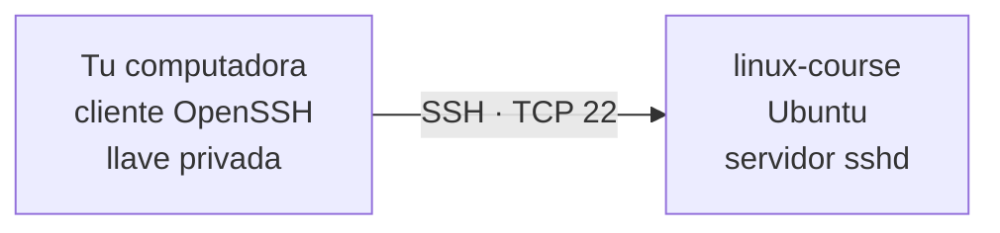
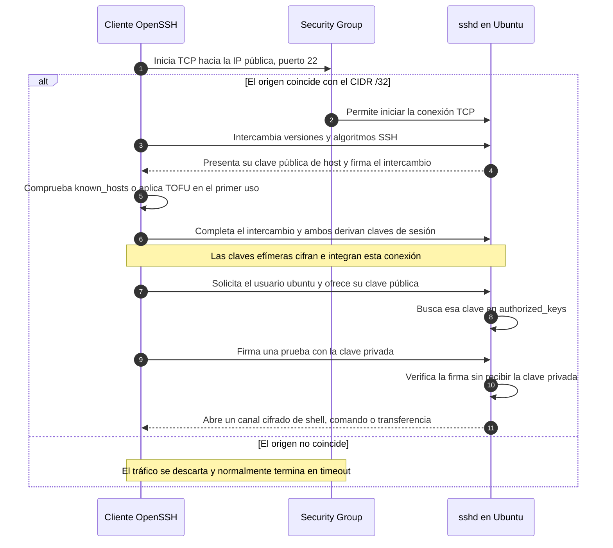
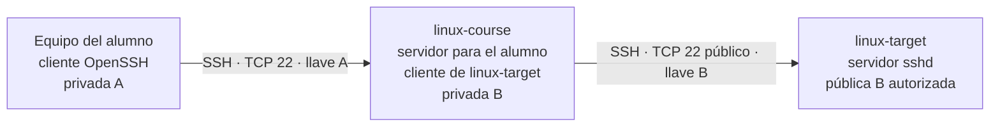
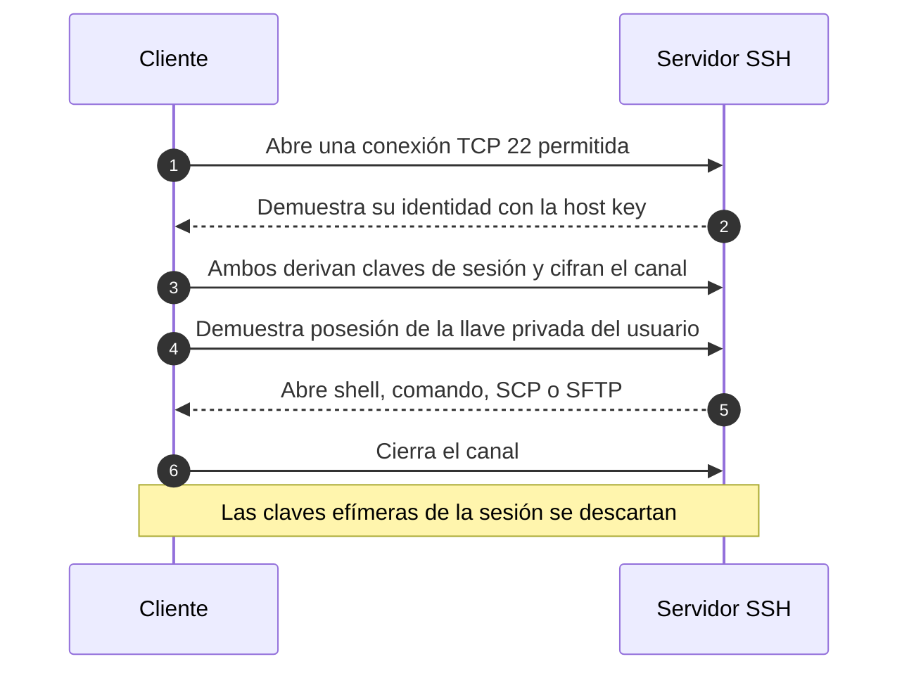

# 02 — Entender y practicar SSH, SCP y SFTP

Esta lección explica qué ocurre realmente cuando te conectas a Linux. Primero usarás tu computadora como cliente y `linux-course` como servidor. Después, si necesitas practicar Linux a Linux, crearás `linux-target` con el segundo template del curso.

Al terminar podrás explicar la conexión, no sólo repetir comandos.

## Índice

- [Resultado esperado](#resultado-esperado)
- [1. El modelo cliente-servidor](#1-el-modelo-cliente-servidor)
- [2. Las capas de una conexión SSH](#2-las-capas-de-una-conexión-ssh)
- [3. Tres clases de claves que no deben confundirse](#3-tres-clases-de-claves-que-no-deben-confundirse)
- [4. Qué sucede durante la conexión](#4-qué-sucede-durante-la-conexión)
- [5. Qué aporta la AMI](#5-qué-aporta-la-ami)
- [6. Práctica guiada con una EC2](#6-práctica-guiada-con-una-ec2)
- [7. SSH entre dos EC2](#7-ssh-entre-dos-ec2)
- [8. ¿Conviene usar Docker para esta práctica?](#8-conviene-usar-docker-para-esta-práctica)
- [9. Diagnóstico por capas](#9-diagnóstico-por-capas)
- [Comprobación final](#comprobación-final)

## Resultado esperado

La práctica está completa cuando puedas:

- distinguir cliente, servidor y puerto de red;
- explicar para qué sirven `authorized_keys` y `known_hosts`;
- entrar con `ssh`, subir y descargar con `scp`, y explorar con `sftp`;
- identificar si un fallo pertenece a red, identidad del servidor, autenticación o permisos;
- explicar por qué Docker no participa en esta conexión.

## 1. El modelo cliente-servidor

SSH significa **Secure Shell**. Es un protocolo para abrir un canal cifrado entre un cliente y un servidor. En esta primera práctica:



- **Cliente:** el programa `ssh` que inicias en Linux o PowerShell.
- **Servidor:** el proceso `sshd` que permanece escuchando en Ubuntu.
- **Puerto:** `22/TCP` de forma predeterminada.
- **VS Code Remote-SSH:** usa ese mismo cliente y ese mismo canal; no es otro protocolo.

Los programas cumplen tareas distintas, pero comparten la conexión SSH:

| Programa | Para qué se usa | Conexión |
|---|---|---|
| `ssh` | Abrir una shell o ejecutar un comando remoto. | SSH sobre TCP 22. |
| `scp` | Copiar indicando un origen y un destino. | SSH sobre TCP 22; OpenSSH moderno usa normalmente el subsistema SFTP. |
| `sftp` | Transferir archivos en una sesión interactiva. | Subsistema SFTP dentro de SSH, también sobre TCP 22. |

No abras los puertos de FTP. `scp` y `sftp` reutilizan el puerto 22 y la misma autenticación de SSH.

## 2. Las capas de una conexión SSH

Piensa en seis puertas consecutivas:

1. **Nombre o dirección:** el alias debe resolver al DNS o IP correctos.
2. **Red:** Internet Gateway, ruta y Security Group deben permitir iniciar TCP 22 desde tu IPv4 `/32`.
3. **Servicio:** `sshd` debe estar instalado, activo y escuchando.
4. **Identidad del servidor:** su host key debe coincidir con `known_hosts`.
5. **Autenticación del usuario:** `ubuntu` debe demostrar que posee la llave privada correcta.
6. **Sesión:** Linux aplica permisos al comando, carpeta o archivo solicitado.

El Security Group sólo filtra tráfico. No cifra, no valida llaves y no crea usuarios. Además es **stateful**: si permite iniciar la conexión desde tu cliente, la respuesta puede regresar sin abrir un “puerto de vuelta”.

## 3. Tres clases de claves que no deben confundirse

| Clave | Pregunta que responde | Dónde vive |
|---|---|---|
| **Llave del usuario** | “¿Este cliente puede entrar como `ubuntu`?” | Privada en el cliente; pública en `~ubuntu/.ssh/authorized_keys`. |
| **Host key** | “¿Este servidor es el mismo que conocí antes?” | Privada en `/etc/ssh/ssh_host_*`; su clave pública queda registrada en `known_hosts` y OpenSSH muestra su huella. |
| **Claves de sesión** | “¿Con qué se cifra esta conexión?” | Se derivan durante el intercambio, viven temporalmente en memoria y se descartan al cerrar. |

AWS llama **EC2 Key Pair** a la primera pareja. Al iniciar una instancia Linux, la parte pública seleccionada se coloca en `authorized_keys`; la `.pem` privada permanece con el alumno. El servidor nunca necesita recibirla.

`known_hosts` y `authorized_keys` no son equivalentes:

- `known_hosts` protege al **cliente** frente a un servidor inesperado;
- `authorized_keys` protege al **servidor** y enumera las claves públicas que pueden autenticar usuarios.

## 4. Qué sucede durante la conexión



### La primera huella y TOFU

En la primera conexión el cliente aún no conoce la host key. OpenSSH muestra una huella y pide confirmación. Ese modelo se llama **Trust On First Use (TOFU)**: confías en la identidad observada la primera vez y las siguientes conexiones detectan cambios.

Comprueba como mínimo que acabas de crear la instancia y que la IP o DNS coincide con el Output del stack. En un entorno administrado, el instructor puede comparar la huella por un canal independiente. No aceptes una huella nueva de forma automática ni borres todo `known_hosts` ante una alerta.

## 5. Qué aporta la AMI

Los templates crean la red, el Security Group y la instancia, pero **no instalan paquetes mediante UserData**. Al arrancar, EC2 crea el disco raíz con el mapeo definido por la AMI; el software inicial también depende de esa imagen.

Para estas guías usa una AMI oficial de Canonical o una AMI del instructor basada en Ubuntu y previamente verificada. Debe ofrecer:

- Ubuntu Server LTS, arquitectura `x86_64`, en la misma región y sin cargos de software de Marketplace;
- el usuario inicial `ubuntu`;
- `cloud-init`, para instalar la clave pública seleccionada al primer arranque;
- OpenSSH Server;
- un disco raíz EBS marcado para eliminarse al terminar la instancia.

Una AMI personalizada puede traer Docker u otras herramientas. Eso no sustituye a OpenSSH ni cambia el protocolo. Una AMI arbitraria también podría usar otro usuario o no procesar el Key Pair; por eso no se elige sólo por su nombre.

### Haz visible lo que ya estaba instalado

Conecta primero con `ssh linux-course`. Ya dentro de Ubuntu ejecuta:

```bash
whoami
hostname
cat /etc/os-release
command -v ssh
test -x /usr/sbin/sshd && echo "sshd está instalado"
dpkg-query -W openssh-client openssh-server
systemctl is-active ssh
sudo ss -lntp | grep ':22'
```

Qué debes reconocer:

- `/usr/bin/ssh` es el cliente;
- `/usr/sbin/sshd` es el servidor;
- `active` confirma que el servicio está ejecutándose;
- `LISTEN` en `:22` confirma que espera conexiones.

La primera conexión ya demuestra que `sshd` era accesible; estos comandos permiten inspeccionar la causa en vez de tratar la AMI como una caja negra.

Revisa también la autorización sin mostrar ninguna clave privada:

```bash
stat -c '%A %U:%G %n' "$HOME/.ssh" "$HOME/.ssh/authorized_keys"
ssh-keygen -lf "$HOME/.ssh/authorized_keys"
sudo ssh-keygen -lf /etc/ssh/ssh_host_ed25519_key.pub
```

El primer fingerprint corresponde a una llave pública autorizada para el usuario. El último corresponde a la identidad del host; son propósitos distintos.

## 6. Práctica guiada con una EC2

### Antes de empezar

Confirma que:

- el stack `linux-course-main` está en `CREATE_COMPLETE`;
- la instancia `linux-course` está en `Running` y con checks `2/2`;
- el alias de [01 — EC2 y VS Code](../01-ec2-y-vscode/README.md) existe;
- `ssh linux-course` funciona desde una terminal de tu computadora.

Si el prompt comienza con `ubuntu@ip-...`, ya estás dentro de la EC2. Ejecuta `exit`. Las terminales de una ventana VS Code Remote-SSH también son remotas; para esta parte usa una terminal local o PowerShell.

### 6.1 Shell interactiva

**En tu computadora**, ejecuta:

```bash
ssh linux-course
```

**Dentro de Ubuntu**, comprueba el contexto:

```bash
whoami
hostname
pwd
```

Regresa al cliente:

```bash
exit
```

`ssh linux-course` abre una shell interactiva. En cambio, `ssh linux-course 'comando'` abre un canal de ejecución, corre ese comando en Ubuntu, devuelve su salida y cierra la conexión.

Prueba desde tu computadora:

```bash
ssh linux-course 'whoami && hostname'
```

### 6.2 Subir con SCP

Primero crea un archivo pequeño **en tu computadora**.

En Linux:

```bash
printf 'Archivo creado en el cliente Linux\n' > "$HOME/mensaje-local.txt"
scp "$HOME/mensaje-local.txt" linux-course:/home/ubuntu/
```

En PowerShell:

```powershell
'Archivo creado en el cliente Windows' | Set-Content "$HOME\mensaje-local.txt"
scp "$HOME\mensaje-local.txt" linux-course:/home/ubuntu/
```

La sintaxis `linux-course:/home/ubuntu/` significa “host remoto `linux-course`, ruta `/home/ubuntu/`”. Comprueba:

```bash
ssh linux-course 'ls -l /home/ubuntu/mensaje-local.txt && cat /home/ubuntu/mensaje-local.txt'
```

### 6.3 Descargar con SCP

Crea una respuesta en Ubuntu mediante un comando remoto:

```bash
ssh linux-course 'date > /home/ubuntu/respuesta-remota.txt'
```

Descárgala en Linux:

```bash
scp linux-course:/home/ubuntu/respuesta-remota.txt "$HOME/respuesta-remota.txt"
cat "$HOME/respuesta-remota.txt"
```

O en PowerShell:

```powershell
scp linux-course:/home/ubuntu/respuesta-remota.txt "$HOME\respuesta-remota.txt"
Get-Content "$HOME\respuesta-remota.txt"
```

### 6.4 Explorar con SFTP

Primero coloca la terminal local en la carpeta donde creaste los archivos.

En Linux:

```bash
cd "$HOME"
sftp linux-course
```

En PowerShell:

```powershell
Set-Location $HOME
sftp linux-course
```

Dentro de SFTP:

```text
pwd
lpwd
ls
lls
put mensaje-local.txt
get respuesta-remota.txt
bye
```

- `pwd` y `ls` consultan el servidor.
- `lpwd` y `lls` consultan el cliente local; la `l` ayuda a recordar **local**.
- `put` sube y `get` descarga.

## 7. SSH entre dos EC2

Para la práctica Linux a Linux, `linux-course` tendrá dos papeles: es servidor cuando entras desde tu computadora y cliente cuando conecta a `linux-target`.



Son dos conexiones independientes y dos pares de llaves:

- **A:** la `.pem` queda en tu computadora y permite entrar a `linux-course`;
- **B:** se genera dentro de `linux-course`; su privada permanece allí y su pública autoriza el acceso a `linux-target`.

Las VPC de los templates no están conectadas entre sí. Por eso la segunda conexión usa la IP o DNS público de `linux-target`, limitado a la IP pública de `linux-course` con `/32`.

Sigue [Práctica SSH Linux a Linux — dos EC2](dos-ec2.md) sólo cuando necesites ese escenario. La Clase 4 permanece independiente y no se modifica con esta preparación.

## 8. ¿Conviene usar Docker para esta práctica?

**No para el recorrido principal.** Queremos observar dos hosts Linux reales, su red, `sshd`, usuarios y archivos.

Ejecutar el servidor SSH en un contenedor exigiría añadir:

- instalación y configuración de otro `sshd`;
- usuario y claves dentro del contenedor;
- publicación de un puerto, por ejemplo `2222:22`;
- una capa adicional de NAT y red de Docker.

Eso convertiría un diagnóstico SSH en un diagnóstico de SSH **más** Docker. Además, la forma habitual de abrir una shell dentro de un contenedor administrado localmente es `docker exec`, no instalar un servidor SSH en cada contenedor.

Si tu AMI ya incluye Docker, no hay conflicto: Docker es otra aplicación del host y puede ignorarse durante esta práctica. Más adelante puede compararse, de forma opcional, `ssh usuario@host` con `docker exec -it contenedor sh`, pero no son equivalentes: el primero entra a otro host por red; el segundo inicia un proceso dentro de un contenedor mediante el daemon local.

## 9. Diagnóstico por capas

Lee el mensaje antes de cambiar configuraciones:

| Síntoma | Lo que ya sabes | Qué revisar |
|---|---|---|
| `Could not resolve hostname` | Aún no se intentó SSH. | Alias, escritura de DNS e IP. |
| Timeout | No se completó TCP 22. | Estado EC2, IP actual, ruta, Security Group `/32` y `sshd`. |
| `Connection refused` | La red llegó a un destino que rechazó. | Servicio `ssh`, escucha en 22 o puerto incorrecto. |
| `REMOTE HOST IDENTIFICATION HAS CHANGED` | La host key difiere de la registrada. | Confirma si la instancia fue reemplazada; no borres entradas a ciegas. |
| `Permission denied (publickey)` | Red e identidad del host ya funcionaron. | Usuario `ubuntu`, `IdentityFile`, Key Pair y permisos de la privada. |
| `scp: Permission denied` sobre una ruta | SSH autenticó; falla el acceso al archivo. | Ruta, propietario y permisos Linux. |
| El archivo “desapareció” | Puede estar en el otro contexto. | `pwd`, `lpwd`, origen y destino. |

Para ver en qué capa falla, usa salida detallada desde el cliente:

```bash
ssh -v linux-course
```

`-v` significa **verbose**: muestra decisiones de conexión y autenticación. No publiques la salida completa sin revisarla; puede contener nombres, rutas e IPs de tu entorno.

## Comprobación final

Explica con tus palabras esta secuencia:



Tu preparación está lista si puedes entrar, transferir en ambos sentidos y ubicar un fallo en la capa correcta. La llave privada de cada conexión permanece únicamente en su cliente correspondiente.

Referencias: [EC2 Key Pairs](https://docs.aws.amazon.com/AWSEC2/latest/UserGuide/ec2-key-pairs.html), [manual de OpenSSH `ssh`](https://man.openbsd.org/ssh) y [seguridad de Docker](https://docs.docker.com/engine/security/).
