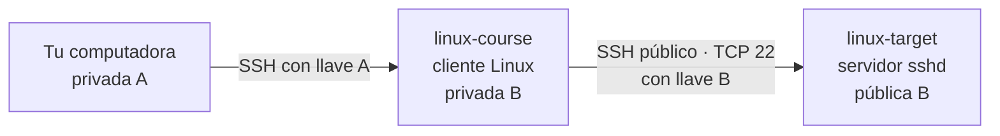
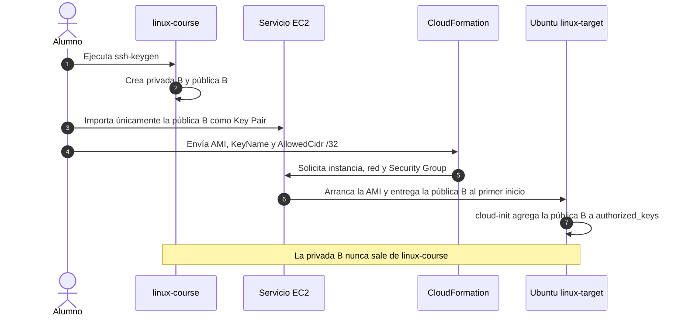

# Práctica SSH Linux a Linux — dos EC2

Esta ampliación usa `linux-course` como cliente Linux y crea un servidor temporal llamado `linux-target` mediante [`setup-templates/1-ec2-ssh/ec2-ssh.yml`](../../setup-templates/1-ec2-ssh/ec2-ssh.yml).

Realízala sólo cuando necesites practicar entre dos hosts. Antes estudia [la teoría de SSH, SCP y SFTP](README.md).

## Índice

- [Arquitectura](#arquitectura)
- [Antes de empezar](#antes-de-empezar)
- [1. Crea la llave B en linux-course](#1-crea-la-llave-b-en-linux-course)
- [2. Importa únicamente la pública B](#2-importa-únicamente-la-pública-b)
- [3. Reúne AMI e IP de origen](#3-reúne-ami-e-ip-de-origen)
- [4. Crea linux-target con CloudFormation](#4-crea-linux-target-con-cloudformation)
- [5. Configura el alias y verifica la identidad](#5-configura-el-alias-y-verifica-la-identidad)
- [6. Practica SSH, SCP y SFTP](#6-practica-ssh-scp-y-sftp)
- [Limpieza completa](#limpieza-completa)
- [Si una IP cambia](#si-una-ip-cambia)

## Arquitectura



- La `.pem` **A** permanece en tu computadora y permite entrar a `linux-course`.
- La privada **B** se genera y permanece en `linux-course`.
- AWS recibe únicamente la pública B y la coloca en `linux-target` al iniciar.
- Las dos VPC no tienen peering; la conexión B usa direcciones públicas.
- El Security Group de `linux-target` acepta TCP 22 sólo desde la IPv4 pública de `linux-course`.



## Antes de empezar

Confirma lo siguiente:

- `linux-course` está encendida y `ssh linux-course` funciona;
- usarás la misma región AWS para ambos stacks;
- puedes consultar la **Public IPv4 address actual** de `linux-course` en EC2;
- tienes el archivo `setup-templates/1-ec2-ssh/ec2-ssh.yml`;
- terminarás `linux-target` al acabar.

> **Costo.** Dos instancias consumen el mismo beneficio o saldo de créditos de la cuenta; no reciben coberturas independientes. Comprueba en la consola que la AMI y `t3.micro` estén marcadas como **Free tier eligible** para tu cuenta.

## 1. Crea la llave B en linux-course

**En tu computadora**, entra a la instancia principal. Si ya estás en una terminal de VS Code Remote-SSH, omite este comando:

```bash
ssh linux-course
```

A partir de aquí el prompt debe pertenecer a **`linux-course`**. Compruébalo:

```bash
whoami
hostname
```

Genera una pareja exclusiva para la segunda conexión:

```bash
if [ -e "$HOME/.ssh/linux-client-to-target" ] || \
   [ -e "$HOME/.ssh/linux-client-to-target.pub" ]; then
  echo "DETENTE: ya existe al menos un archivo de esta pareja"
else
  echo "La ruta está disponible"
fi
```

Si ves `La ruta está disponible`, continúa. Si alguno de los archivos ya existe, no lo sobrescribas: reutiliza ambos únicamente si pertenecen a esta misma práctica y el fingerprint de la pública coincide con el Key Pair importado. Si tienes dudas, completa primero [la limpieza](#limpieza-completa) y vuelve a empezar.

```bash
ssh-keygen -t ed25519 \
  -f "$HOME/.ssh/linux-client-to-target" \
  -C "linux-course-to-target"
```

`-f` ya fija la ruta. Sólo se preguntará una passphrase; para este laboratorio temporal puedes dejarla vacía con `Enter` dos veces. En un entorno permanente se usa una passphrase y un agente SSH.

Comprueba los dos archivos:

```bash
ls -l "$HOME/.ssh/linux-client-to-target"*
ssh-keygen -lf "$HOME/.ssh/linux-client-to-target.pub"
```

- `linux-client-to-target`: privada B; no la muestres ni la copies.
- `linux-client-to-target.pub`: pública B; ésta sí se importa.

Muestra la pública para copiarla:

```bash
cat "$HOME/.ssh/linux-client-to-target.pub"
```

## 2. Importa únicamente la pública B

En AWS, dentro de la misma región, abre **EC2 → Network & Security → Key Pairs → Import key pair**:

- **Name:** `linux-client-to-target`;
- **Public key contents:** pega la línea completa que comienza con `ssh-ed25519`.

Selecciona **Import key pair**. AWS guarda la parte pública; no descarga ni necesita una `.pem` para esta conexión.

## 3. Reúne AMI e IP de origen

### 3.1 AMI de Ubuntu

En **EC2 → Instances**, selecciona `linux-course` y abre **Details → AMI ID**. Puedes reutilizar ese ID si la imagen sigue disponible, usa Ubuntu Server LTS `x86_64`, no tiene cargos de software de Marketplace y cumple los requisitos descritos en [Qué aporta la AMI](README.md#5-qué-aporta-la-ami).

La AMI y el Key Pair son regionales. Un ID copiado de otra región no funcionará. La pantalla **Details** no demuestra por sí sola la cobertura gratuita: confirma también que `t3.micro` sea elegible para tu cuenta y que tengas saldo o vigencia disponible.

### 3.2 IPv4 pública de linux-course

En **EC2 → Instances**, selecciona `linux-course` y copia su **Public IPv4 address actual**. Agrega `/32`.

Ejemplo:

```text
198.51.100.25/32
```

Éste será `AllowedCidr`. Como la conexión sale por la ruta pública de `linux-course`, ésa es la dirección que verá el Security Group del destino. No uses la IP privada `10.x.x.x` ni `0.0.0.0/0`. Usa la vista actual de EC2: un Output de CloudFormation puede conservar el valor anterior si detuviste e iniciaste la instancia fuera del stack.

## 4. Crea linux-target con CloudFormation

En AWS abre **CloudFormation → Stacks → Create stack → With new resources (standard)**:

1. Elige **Choose an existing template**.
2. Elige **Upload a template file**.
3. Carga [`setup-templates/1-ec2-ssh/ec2-ssh.yml`](../../setup-templates/1-ec2-ssh/ec2-ssh.yml).
4. Selecciona **Next**.
5. Usa el nombre de stack `linux-ssh-target`.

Completa los parámetros:

| Parámetro | Valor |
|---|---|
| `ProjectName` | `linux-ssh-target` |
| `AmiId` | AMI obtenida en 3.1 |
| `InstanceType` | `t3.micro` |
| `KeyName` | `linux-client-to-target` |
| `AllowedCidr` | Public IPv4 actual de `linux-course` con `/32` |
| `VpcCidr` | conserva `10.20.0.0/16` |
| `PublicSubnetCidr` | conserva `10.20.1.0/24` |

Conserva las demás opciones y selecciona **Submit**. El template no solicita capabilities IAM.

Espera `CREATE_COMPLETE`. En **Outputs**, registra:

- `InstanceId`;
- `PublicIp`;
- `PublicDnsName`.

En EC2, selecciona ese `InstanceId` y espera checks `2/2` antes de probar SSH.

## 5. Configura el alias y verifica la identidad

Regresa a la terminal de **`linux-course`** y edita:

```bash
nano "$HOME/.ssh/config"
```

Agrega el bloque, sustituyendo el DNS por el Output real:

```text
Host linux-target
  HostName ec2-203-0-113-20.compute-1.amazonaws.com
  User ubuntu
  IdentityFile ~/.ssh/linux-client-to-target
  IdentitiesOnly yes
```

Guarda con `Ctrl+O`, confirma con `Enter`, sal con `Ctrl+X` y protege el archivo:

```bash
chmod 600 "$HOME/.ssh/config"
ssh linux-target
```

En la primera conexión:

1. confirma que el DNS o la IP mostrada coincide con el Output recién creado;
2. acepta la huella sólo para esta nueva instancia;
3. recuerda que esto es TOFU, no una verificación criptográfica fuera de banda.

Dentro de `linux-target`:

```bash
whoami
hostname
cat /etc/os-release
systemctl is-active ssh
exit
```

Debes ver el usuario `ubuntu`, otro hostname y el servicio `ssh` activo.

## 6. Practica SSH, SCP y SFTP

Estos comandos se ejecutan en **`linux-course`**.

### Ejecutar sin abrir una shell

```bash
ssh linux-target 'whoami && hostname && pwd'
```

### Copiar hacia el destino

```bash
printf 'Enviado desde linux-course\n' > "$HOME/archivo.txt"
scp "$HOME/archivo.txt" linux-target:/home/ubuntu/
ssh linux-target 'cat /home/ubuntu/archivo.txt'
```

### Copiar de regreso

```bash
ssh linux-target 'date > /home/ubuntu/respuesta-target.txt'
scp linux-target:/home/ubuntu/respuesta-target.txt "$HOME/"
cat "$HOME/respuesta-target.txt"
```

### Abrir SFTP

```bash
sftp linux-target
```

Dentro de SFTP prueba `pwd`, `lpwd`, `ls`, `lls` y `bye`. No se abre otro puerto: todo viaja por el canal SSH de TCP 22.

## Limpieza completa

Hazla al terminar, en este orden:

1. En **CloudFormation → Stacks → linux-ssh-target**, selecciona **Delete**.
2. Espera a que el stack desaparezca. Esto elimina EC2, Security Group y red destino; con **Delete on termination** activo también se elimina el disco raíz.
3. En **EC2 → Volumes**, confirma que no haya un volumen `available` de `linux-target`; después elimina el Key Pair `linux-client-to-target`.
4. En `linux-course`, elimina únicamente el bloque `Host linux-target` de `~/.ssh/config`.
5. Después de confirmar que el stack ya no existe, retira sus entradas conocidas con los valores que guardaste:

   ```bash
   ssh-keygen -R PUBLIC_DNS_REAL
   ssh-keygen -R IP_PUBLICA_REAL
   ```

6. Si no repetirás la práctica, borra la pareja B de `linux-course`:

   ```bash
   rm "$HOME/.ssh/linux-client-to-target" \
      "$HOME/.ssh/linux-client-to-target.pub"
   ```

No elimines `linux-course-main`, la `.pem` A ni el alias `linux-course`: pertenecen al laboratorio principal.

## Si una IP cambia

- Si `linux-course` se detiene y vuelve a iniciar, consulta su **Public IPv4 address** actual en EC2 y actualiza `AllowedCidr` del stack destino con el nuevo valor `/32`.
- Si `linux-target` cambia o es reemplazada, actualiza `HostName` y verifica la nueva host key antes de retirar la entrada anterior.
- Un cambio de IP no justifica abrir `0.0.0.0/0`.
